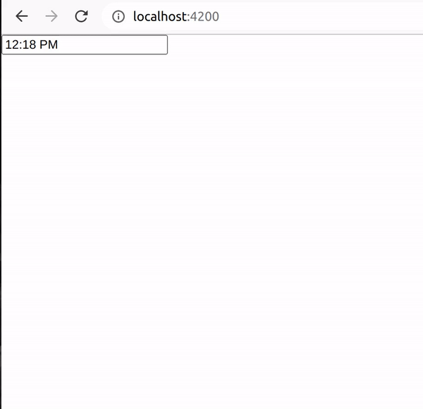
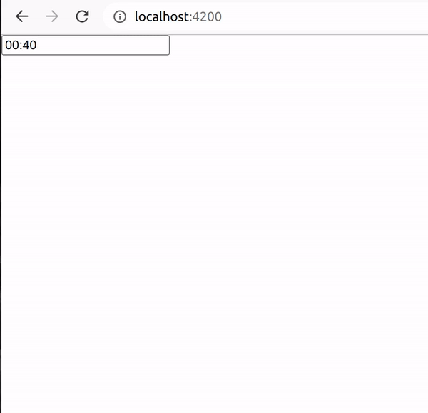

# ngx-angular-time-picker-library

This is a simple time picker which has infinite scrolling(UP/DOWN) for Angular. Time format 12hr/24hr supported.

## Install

```bash
npm install ngx-angular-time-picker-library --save
```

## Demo Link Below

[Live Demo](https://ngx-angular-time-picker.bittokazi.com/)

## Example 12hr



## Example 24hr



## Usage

#### in html file (_app.component.html_)

```html
<form [formGroup]="form" style="float: left; width: 100%">
  <ngx-angular-time-picker
    [control]="form.controls.time"
    (onTimeChange)="onTimeChange($event)"
    [top]="'20px'"
    [left]="'0px'"
    [enableSecond]="true"
    [format]="'12hr'"
    [backgroundColorCell]="'#00b6ff'"
    [backgroundColorCellHover]="'#b0e8ff'"
  >
    <input
      type="text"
      formControlName="time"
      #timePickerInput
      (focus)="timePickerInput.blur()"
    />
  </ngx-angular-time-picker>
</form>
```

<br>

#### in componet file (_app.component.ts_)

```typescript
import { Component, OnInit } from "@angular/core";
import { FormControl, FormGroup } from "@angular/forms";

@Component({
  selector: "app-root",
  templateUrl: "./app.component.html",
  styleUrls: ["./app.component.scss"],
})
export class AppComponent implements OnInit {
  public form: any;

  constructor() {
    this.form = new FormGroup({
      time: new FormControl("12:40 AM"),
    });
  }

  ngOnInit(): void {}

  onTimeChange($event: any) {
    console.log($event);
  }
}
```

<br>

#### in modeule file (_app.module.ts_)

```typescript
import { NgModule } from "@angular/core";
import { BrowserModule } from "@angular/platform-browser";
import { AppRoutingModule } from "./app-routing.module";
import { AppComponent } from "./app.component";
import { BrowserAnimationsModule } from "@angular/platform-browser/animations";
import { NgxAngularTimePickerLibraryModule } from "ngx-angular-time-picker-library";
import { ReactiveFormsModule } from "@angular/forms";

@NgModule({
  declarations: [AppComponent],
  imports: [
    BrowserModule,
    AppRoutingModule,
    BrowserAnimationsModule,
    ReactiveFormsModule,
    AngularTimePickerLibrary,
  ],
  providers: [],
  bootstrap: [AppComponent],
})
export class AppModule {}
```

<br>

## Options

### Props

| Props                                | Default | Description                              |
| ------------------------------------ | ------- | ---------------------------------------- |
| **control**: FormControl             | null    | FormControl                              |
| **top**: string                      | 0px     | offset from input                        |
| **left**: string                     | 0px     | offset from left                         |
| **enableSecond**: boolean            | false   | If second can be selected                |
| **format**: string                   | 24hr    | can be 12hr or 24hr                      |
| **backgroundColorCell**: string      | #00b6ff | Background color of selected cell        |
| **backgroundColorCellHover**: string | #b0e8ff | Background color when hovering over cell |

### Callback Methods

| Name                 | Type   | Description                                                                   |
| -------------------- | :----- | ----------------------------------------------------------------------------- |
| onTimeChange(Object) | Object | Outputs time in 24hr and 12hr example: { "24hr": "00:00", "12hr": "12:00 AM"} |
